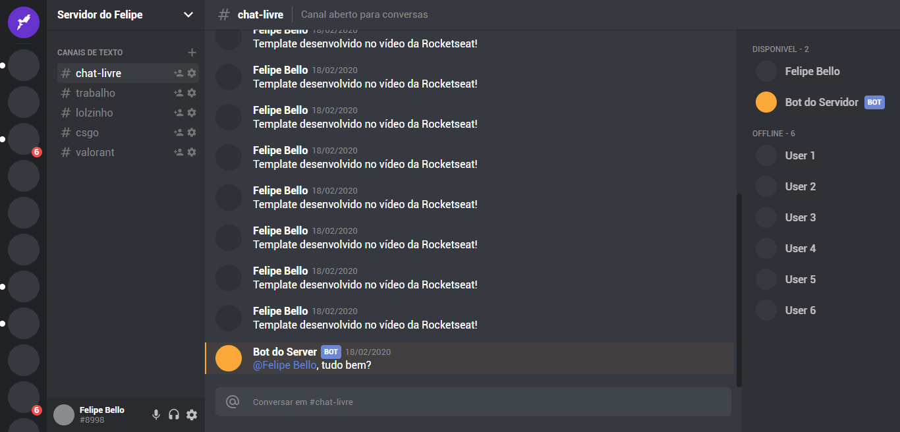

# Template cópia do Discord

Template desenvolvido em um vídeo da [Rocketseat](https://www.linkedin.com/school/rocketseat/)

## Instalação e modo de uso

Como durante o desenvolvimento foi utilizado o [Yarn](https://yarnpkg.com/) (pode ser utilizado o [NPM](https://www.npmjs.com/) se preferir) como gerenciador de pacotes, execute o comando `yarn` na raiz do projeto para baixar as dependências.

Com as dependências já baixadas, basta iniciar o servidor. Uso o comando `yarn start` para fazer isso (novamente, pode ser utilizado o [NPM](https://www.npmjs.com/) se preferir)

## Quais tecnologias foram usadas?

1. [ReactJS](https://reactjs.org/)
2. [Typescript](https://www.typescriptlang.org/)
3. [Styled Components](https://styled-components.com/),
4. [CSS Grid](https://www.w3schools.com/css/css_grid.asp)
5. [CSS Display Flex](https://www.w3schools.com/css/css3_flexbox.asp)

Créditos para [Rocketseat](https://www.linkedin.com/school/rocketseat/) e link do vídeo: [Recriando a Interface do Discord com ReactJS | UI Clone](https://www.youtube.com/watch?v=x4FdZd2-_uU)
